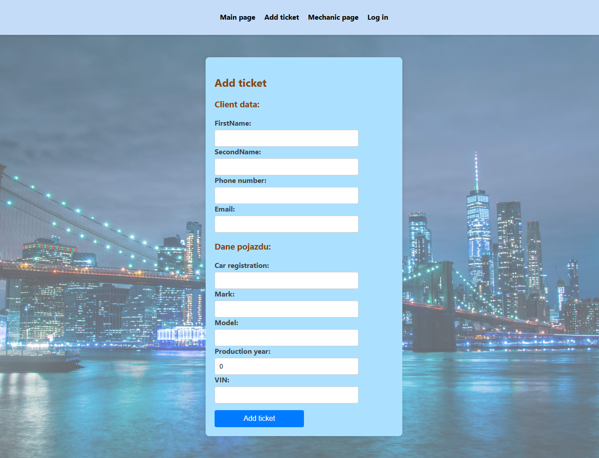
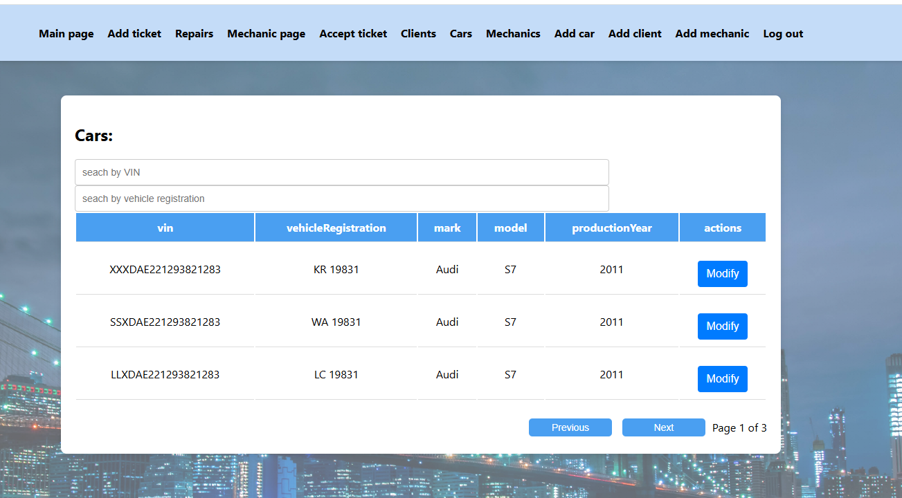
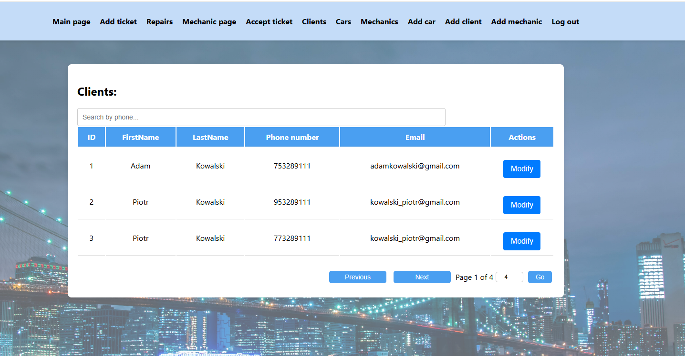
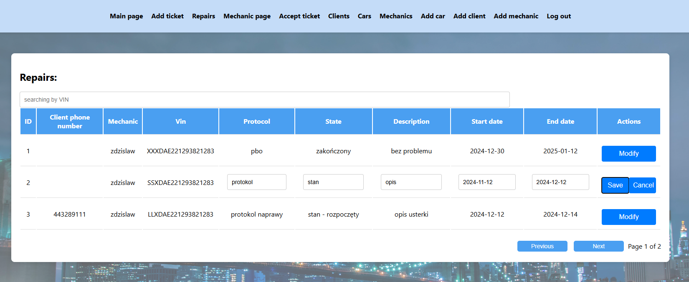
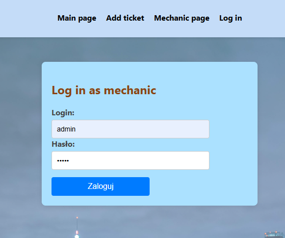

# AutoRepairShop

## About project
Fronted application created in React for AutoRepairShop application from: https://github.com/dmarczuk/AutoRepairShopFrontend

## Main responsibilities application
<ul>
<li>Adding new ticket</li>
<li>Add and modify clients, cars, mechanics adn repairs</li>
<li>Display list of clients, cars, mechanics and repairs</li>
<li>Searching data in list of clients, cars, mechanics and repairs</li>
<li>Login as mechanic or admin</li>
</ul>

## Technologies used in project

  
  
  

 

## Screens from application
Some screens of application:
<ul>
<li>Adding new ticket -> Client can add new ticket</li>

<li>Mechanic or admin can display lists of clients, cars, repairs and mechanics
-> It is possible to search cars by VIN</li>

<li>List of clients</li>

<li>List repairs. Repairs can be modified</li>

<li>admin and mechanic can be authorized by log in</li>

</ul>

## Getting Started with Create React App

This project was bootstrapped with [Create React App](https://github.com/facebook/create-react-app).

## Available Scripts

In the project directory, you can run:

### `yarn start`

Runs the app in the development mode.\
Open [http://localhost:3000](http://localhost:3000) to view it in the browser.

The page will reload if you make edits.\
You will also see any lint errors in the console.

